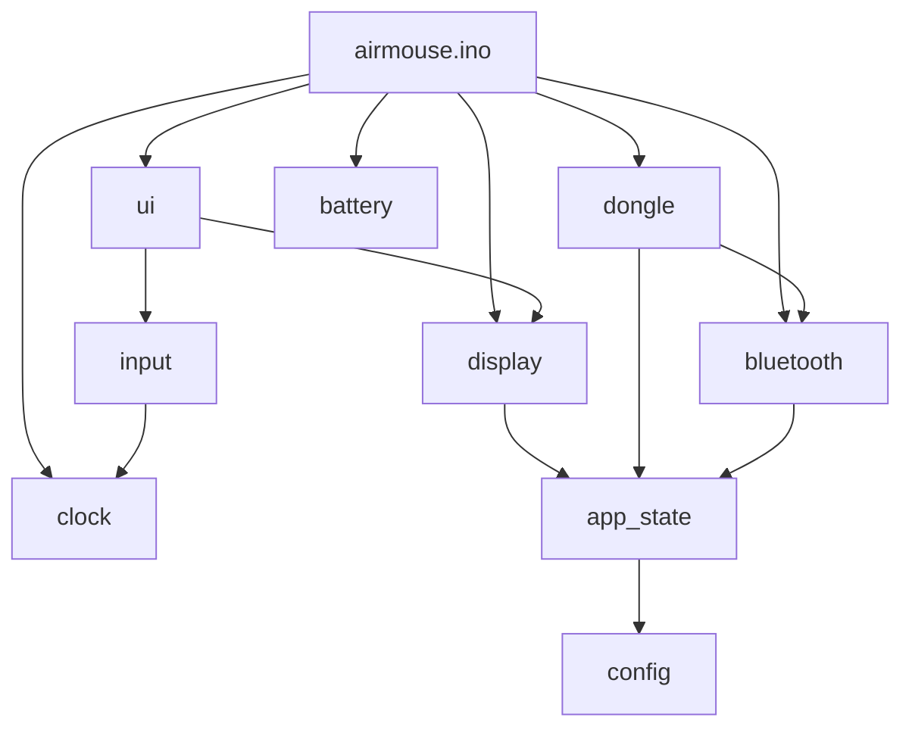

# Air Mouse (ESP32-C3)

Wireless presentation remote with OLED UI, I2S microphone streaming, and dual PC connectivity (ESP-NOW dongle + BLE HID fallback).

## Hardware

| Component | Pins / config |
|-----------|----------------|
| OLED (SSD1306, I2C) | SDA `8`, SCL `9`, addr `0x3C` |
| Menu buttons | Left `1`, Right `10` (active LOW, internal pull-up) |
| Mouse / Win inputs | Up `20`, Down `21`, Left `2`, Right `3`, Win `4` |
| I2S microphone | SD `5`, SCK `6`, WS `7` |
| Battery ADC | `A0` (3.0 V – 4.2 V mapped to 0–5 bars) |

Target board: **ESP32-C3**.

## How it works

1. **Dongle mode (default)** — Sends mouse movement, Win key, and 64 audio samples per packet over **ESP-NOW** to a fixed receiver MAC (`app_state.cpp`). Runs in a dedicated FreeRTOS audio task so streaming stays steady.
2. **Bluetooth mode (fallback)** — If dongle sends fail repeatedly, the device advertises as **"ESP32-C3 Input Combo"** (BLE HID mouse + keyboard). It probes the dongle every 10 s and switches back when it responds.
3. **OLED UI** — Clock on the home screen; menu apps: Stopwatch, Timer, Set Clock, About.

## Project layout

```
airmouse/
├── airmouse.ino       Entry point: setup(), loop(), wiring init
├── config.h           Pins, constants, initial clock — edit hardware here
├── app_state.h        extern declarations for shared globals
├── app_state.cpp      Definitions: UI state, dongle packet, BLE handles
├── battery.h/.cpp     Battery voltage → 0–5 bar level
├── clock.h/.cpp       Internal 24 h clock (700 ms tick granularity)
├── input.h/.cpp       Menu button debounce / short-long / both-press
├── display.h/.cpp     OLED init, status bar, text/time drawing
├── dongle.h/.cpp      ESP-NOW, I2S mic, loopDongle(), audioTask
├── bluetooth.h/.cpp   NimBLE HID setup, mouse/keyboard reports
└── ui.h/.cpp          Screen flow and menu tool logic
```

### Where to change what

| Goal | File(s) |
|------|---------|
| Change pins or battery range | `config.h` |
| Dongle MAC address | `app_state.cpp` → `receiverAddress[]` |
| BLE device name / HID report map | `bluetooth.cpp` |
| Mouse step size or Win key action | `dongle.cpp`, `bluetooth.cpp` |
| New menu item or screen | `ui.cpp`, `app_state.cpp` (`menuItems[]`) |
| Status bar icons / layout | `display.cpp` → `drawStatusBar()` |
| Initial clock at boot | `config.h` → `INIT_HOUR`, `INIT_MIN`, `INIT_SEC` |

## Module dependencies



All modules read/write shared state through `app_state.h`. Avoid adding new globals in random `.cpp` files — declare in `app_state.h`, define in `app_state.cpp`.

## Building

1. Open the `airmouse/` folder in Arduino IDE (sketch name must match folder name).
2. Install libraries: **Adafruit SSD1306**, **Adafruit GFX**, **NimBLE-Arduino** (or your ESP32 BLE stack).
3. Select **ESP32-C3** board and upload.

Only one `.ino` file should exist in this folder. Extra `.ino` files are merged by the IDE and will break the build.

## Button map (menu)

| Input | Action |
|-------|--------|
| Left short | Confirm / Start / Pause / Next field |
| Left long (~1.5 s) | Back |
| Right short | Next item / increment value / toggle mic (home) |
| Both pressed | Jump to home |

## Connection indicator (status bar)

- **Dongle** icon + label — ESP-NOW active
- **Bluetooth** name — BLE fallback active
- Mic icon with slash — mic muted
- Battery bars — 0–5 level from ADC
